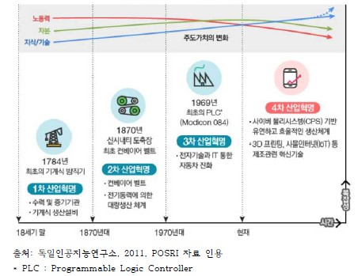

# 4차 산업혁명의 도래

> Chpater 01. 정보사회와 4차 산업혁명을 인용함.
***
## 4차 산업혁명의 개념

**4차 산업혁명**(The Fourth Industrial Revolution)은 2016년 다보스포럼에서 클라우스 슈밥이 처음 제시한 개념이다. 아직까지 충분한 논의가 이루어지지 않아 그 의미가 명확히 정립된것은 아니다. 
4차 산업혁명을 정의하기란 쉽지 않지만, 최근의 노의를 종합해보면 '3차 산업혁명을 기반으로 하여 디지털, 생물학, 물리학 등의 경계가 없어지고 융합되는 기술혁명',
또는 '인터넷을 통해 모아진 인간의 행위와 생각을 온라인 상의 거대한 데이터 저장고에 넣어 활용하는 일련의 경제적 활동'으로 정의할 수 있다.

**Tip**
다보스포럼(Davos Forum)
>매년 스위스의 다보스에서 개최되는 '세계경제포럼(World Economic Forum)연차 총회를 통칭하는 말이다'
***

## 4차 산업혁명의 특징

사물인터넷과 클라우드, 빅데이터 등은 4차 산업혁명을 상징하는 단어이다. 특히 4차 산업혁명은 속도, 범위, 영향력 등의 측면에서 3차 산업혁명과 차별화 되고,
인류가 한 번도 경험하지 못한 새로운 시대를 접하게 될 것이라고 강조되고 있다. 즉 획기적인 기술 진보, 파괴적 기술에 의한 산업 재편, 전반적인 시스템의 변화
등이 4차 산업혁명의 주요 특징이라고 할 수 있다. 이러한 4차 산업혁명은 기술 융햡으로 생산성을 높이고 생산 및 유통 비용을 낮춰 개인의 소득 증가와 살의 질 향상이라는
긍정적 효과를 기대할 수 있다. 하지만 사회적 불평등, 빈부 격차뿐만 아니라 기계가 사람을 대체하면서 우려되는 노동시장의 붕괴와 같은 부정적인 요소도 무시할 수 없다.
특히 향후 노동시장은 '고기술/고임금'과 '저기술/저임금'간의 격차가 벌어지고 일자리 양분으로 중산층의 지위가 축소될 가능성이 크다.

<표>

|구분|설명|
|---|---|
|1차 4차산업혁명|-18세기에 영국에서 증기기관의 발명과 기계식 생산 방식이 도입되면서 시작|
||-농업과 수공업 경제에서 기계를 사용하는 제조업 경제로 전환|
|2차 4차산업혁명|-19세기에 컨베이어 벨트가 도입되고 분업과 자동화 생산이 확산되면서 시작|
||-자동차 등 제조업 제품을 공급자 중심으로 대량생산|
|3차 4차산업혁명|-1970년대부터 자동화 대량생산 체계가 도입되면서 시작되어 현재까지 지속|
||-제조업의 디지털화와 자동화 시작|
|4차 4차산업혁명|-기계와 사람, 인터넷 서비스가 상호 연결되어 가볍고 유연한 생산 체계 구현|
||-대량 맞춤 생산이 가능한 생산 패러다임으로의 진화|

## 4차 산업혁명 시대의 도시

**4차 산업혁명 기술**

* 인공지능   
인간의 지능으로 할 수 있는 사고, 학습, 자기 개발 등을 컴퓨터가 할 수 있도록 하는 방법을 연구하는 컴퓨터 공학 및 정보기술의 한 분야로서, 컴퓨터가 인간의 지능적인 행동을 모방할 수 있도록 하는 것을 인공지능이라고 말하고 있다.
[네이버 지식백과] 인공지능 [artificial intelligence, 人工知能] (두산백과)  

* 빅데이터   
오늘날 정보통신 분야에서의 화두는 단연 빅데이터이다. 빅데이터는 기존 데이터보다 너무 방대하여 기존의 방법이나 도구로 수집/저장/분석 등이 어려운 정형 및 비정형 데이터들을 의미한다. 그림 1과 같이 1분 동안 구글에서는 200만 건의 검색, 유튜브에서는 72시간의 비디오, twitter에서는 27만 건의 트윗이 생성된다. 세계적인 컨설팅 기관인 매켄지(Mckinsey)는 빅데이터를 기존 데이터베이스 관리도구의 데이터 수집, 저장, 관리, 분석하는 역량을 넘어서는 규모로서 그 정의는 주관적이며 앞으로도 계속 변화될 것이라고 언급하고 있다. 어떤 그룹에서는 빅데이터를 테라바이트 이상의 데이터라고 정의하기도 하며 대용량 데이터를 처리하는 아키텍처라고 정의하기도 한다.
[네이버 지식백과] 빅데이터란? (국립중앙과학관 - 빅데이터)  

* 로봇기술   
로봇과 관련한 총체적인 기술(로봇의 설계, 제작, 응용 등)   

4차 산업혁명으로 인한 도시 생활의 변화는 이미 여러 분야에서 활발하게 일어나고 있다. '유비쿼터스 시티'라는 이름의 스마트 도시 사업이 진행되면서 도시의
시설물과 제품 등에는 소위 사물인터넷이 내장되고, 인프라와 인프라 간, 인프라와 디바이스간 ICT 기술의 발전으로 이전에는 불가능했던 일들이 가능해지고 있다.
버스도착안내시스템, 버스관리시스템, 실시간 내비게이션, 교통카드, 스마트 가로등, 고속도로안내시스템, 카카오택시, 자동통행료징수시스템, MOOC(온라인 공개수업)
등이 이미 상용화된 서비스이다. 또한 스마트 홈, 자율협력주행 고속도로시스템, 스마트 진료 서비스, 드론 등은 상용화가 임박했다.
4차 산업혁명의 가장 대표적인 기술은 인공지능, 빅데이터, 로봇 기술 등이 집약된 자율주행 자동차라고 할 수 있다. 구글은 2012년 5월 미국의 네바다 주에서 세계 최초로
무인 자동차로 시험 주행 운전면허를 취득했고, 현재까지 수백만 km이상의 무인 자동차 주행기록을 쌓고 있다. 자율주차, 자동 사고 회피, 자동 경제운전 등
일부 자율기능은 이미 상용화되어 있다. 최근 영국, 독일 등 자동차 선진국에서는 앞다투어 무인 운전 차량의 도로상 테스트를 법적으로 허가하기 시작했고,
스웨덴에서는 이들보다 빨리 시험 주행을 허가했다. 한편 일본은 2020년 하계 올림픽 유치와 함께 무선 예약을 통해 스스로 알아서 손님을 모시러 가고 주차장을
찾아가 다음 손님을 기다리는 무인 자동차 개발을 계획하고 있다.

